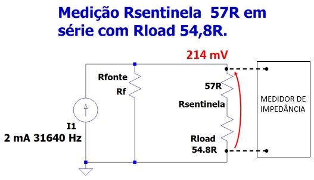

## Medição da impedância Interna da Fonte de Corrente

A medição foi efetuada através do osciloscópio onde foi
medida tensão de 104mVpp @ 31640 Hz sobre resistor sentinela com os 
terminais de excitação de corrente em curto-circuito conforme apresentado na figura.

A Fonte de Corrente gera um sinal de corrente senoidal de
2mApp com frequência de 31640 Hz.

Medição da frequência com osciloscópio:

Medição da tensão com osciloscópio:

### Portanto a corrente real calculada é i = 1,82 mApp. 

Em seguida for efetuada a medição com um resistor de carga de valor medido pelo multímetro de 54.2R conectado
aos terminais de excitação de corrente conforme apresentado na figura a seguir:

A medição foi efetuada através do osciloscópio onde foi medida a tensão de 214mVpp @ 31640 Hz sobre resistor sentinela em série com o resistor de carga
de 54.8R conectado nos terminais de excitação de corrente. Esta medição é apresentada a seguir.

### Portanto a corrente real calculada é i = 1,79 mApp. 
