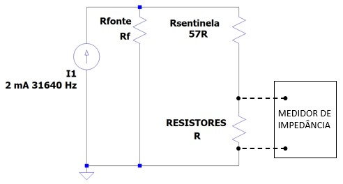
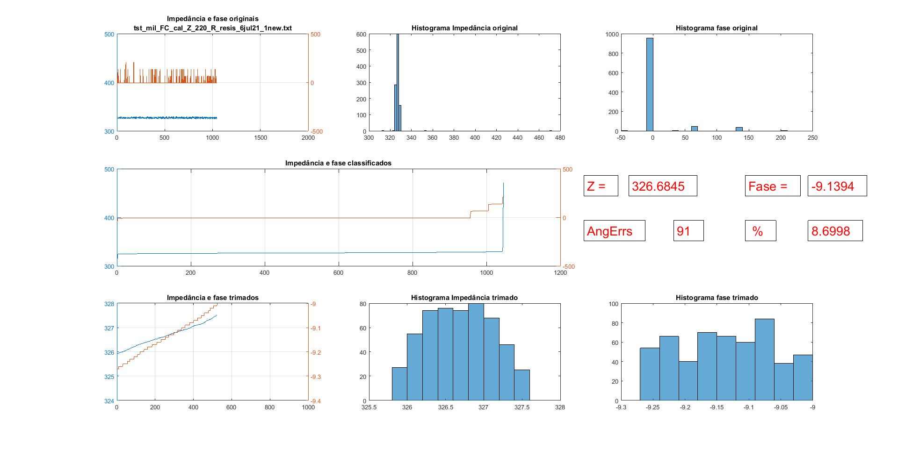
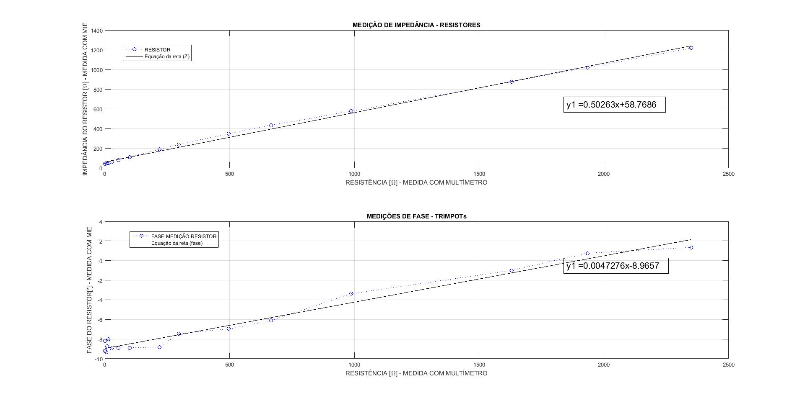

## Medição da impedânia dos RESISTORES com o MIE.

O arquivo /Dados/SoResistores.txt contém 16 pontos de medição de
resistência - de resistores comerciais 5% de tolerância variando de zero à 2350 Ohms - 
medidos com um multímetro digital e dos valores de impedância Z e fase medidas com o MIE conforme figura.
OBs.: Foram efetuadas algumas assossiações em parlelo com os resistores para atingir o valor 
de resistência desejado. 

Os valores dos resistores medidos com o multímetro são de: 1.1R, 5.1R, 9.8R, 14.8R, 27.5R,
54.8R, 99.5R. 219.8R, 295.8R, 497R, 667R, 987R, 1630R, 1934R, 2350R e zero (curto-circuito dos 
terminais de excitação de corrente).

Cada ponto da curva é a média trimada de mil medições efetuadas pelo MIE onde foram eliminadas
o quarcentil superior e inferior das amostras. Os cálculos foram efetuados no Matlab através do código 
/Codigo/SortMatlab_tst_new.m onde cada arquivo "tst_mil_FC_cal_Z_XXXXX_resis_7jun21_3new.txt" foi substituido nas
linhas de código 2 e 3. A figura a seguir apresenta um exemplo da cálculo da média trimada.

A curva de Impedância Multímetro vs Impedância MIE (/Info/curva_Z_fase_RESISTORES.JPG) foi efetuada através 
do código em Matlab no arquivo /Codigo/Somente_RESISTORES.m e pode ser vista a seguir.

 

