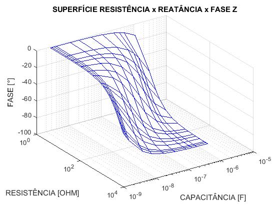

# Estudo do gráfico de superfície de ZLoad (R//C) simulado no LTSpice vs medido no MIE

Nesse estudo foram simulados todas as associações em paralelo entre os resistores e capacitores utilizados na medição
real com o MIE. O objetivo dessa simulação é de determinar o comportamento esperado do circuito eletrônico 
para comparação com a medição efetuada com componentes reais no MIE. O gráfico de simulação pode ser reproduzido através do
arquivo /Codigo/Surf_Z_Fase_RC_paral_simulado_LTSpice.m (figs. 1 e 2), e o gráfico realizado com o MIE no arquivo /Codigo/Plot_R_C_XC_Fase.m (figs. 3 e 4).

Os resistores são: 1.1R, 5.1R, 9.8R, 14.8R, 27.5R, 54.8R, 99.5R, 219.8R, 297R, 497R, 667R, 1630R, 1941R e 2350R.

Os capacitores são: 1.023uF, 470nF, 336.6nF, 226nF, 101.2nF, 47,5nF, 10.31nF 4.2nF, 3.2nF 2.82nF e 2.53nF.

FIGURA 1 - Simulação LTSpice impedância Z (R//C)

 

FIGURA 2 - Simulação LTSpice impedância Fase (R//C)

 

FIGURA 3 - Medição MIE impedância Z (R//C)

 

FIGURA 4 - Medição MIE impedância Fase (R//C)

 
