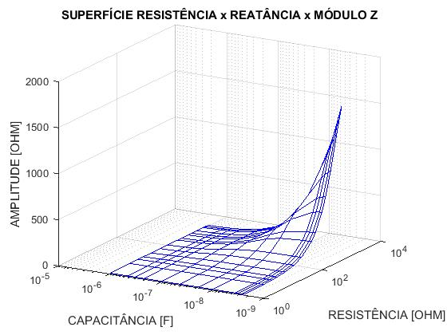
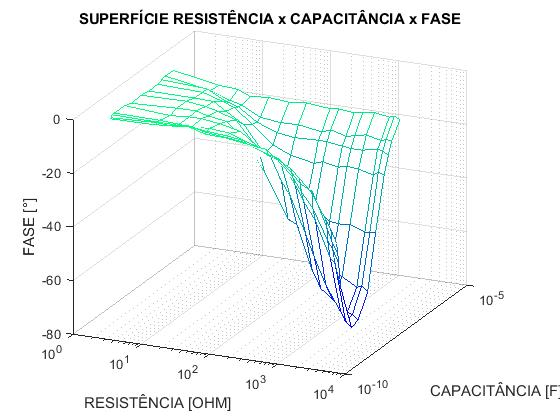

# Estudo do gráfico de superfície de ZLoad (R//C) simulado no LTSpice vs medido no MIE

Nesse estudo foram simulados todas as associações em paralelo entre os resistores e capacitores utilizados na medição
real com o MIE. O objetivo dessa simulação é de determinar o comportamento esperado do circuito eletrônico 
para comparação com a medição efetuada com componentes reais no MIE. O gráfico de simulação pode ser reproduzido através do
arquivo /Codigo/Surf_Z_Fase_RC_paral_simulado_LTSpice.m (figs. 1 e 2), e o gráfico realizado com o MIE no arquivo /Codigo/Plot_R_C_XC_Fase.m (figs. 3 e 4).
Cada ponto dos gráficos da medição representam a média trimada de mil medições efetuadas com o MIE para cada associação em paralelo entre o resistor e capacitor.

Os resistores são: 1.1R, 5.1R, 9.8R, 14.8R, 27.5R, 54.8R, 99.5R, 219.8R, 297R, 497R, 667R, 1630R, 1941R e 2350R.

Os capacitores são: 1.023uF, 470nF, 336.6nF, 226nF, 101.2nF, 47,5nF, 10.31nF 4.2nF, 3.2nF 2.82nF e 2.53nF.

FIGURA 1 - Simulação LTSpice impedância Z (R//C)

 

FIGURA 2 - Simulação LTSpice impedância Fase (R//C)

 

FIGURA 3 - Medição MIE impedância Z (R//C)

 

FIGURA 4 - Medição MIE impedância Fase (R//C)

 

## Procedimento de Simulação no LTSpice

Os dados para cada associação R//C foram simulados conforme circuito eletrônico apresentado na figura 5 por meio do código
/Codigo/Simu_Z_LTSpice_R_paral_C_freq_31250Hz.asc.
Os dados de amplitude Z e fase foram anotados manualmente e armazenados no arquivo excel /Dados/Dados_simulacao_Z_LTSpice_R_paral_C.xls, e
em seguida, os mesmos dados foram introduzidos no código do Matlab no arquivo /Codigo/Plot_R_C_XC_Fase.m para gerar os gráficos de superfície simulados 
nas figuras 3 e 4.

O cursor 1 apresenta o seguinte cálculo representando a impedância sobre o resistor sentinela:

((V001)/I(Rsent))- ((V002)/I(Rsent))

Enquanto que o cursor 2 representa a impedância da carga sobre o resistor em paralelo com capacitor através da o seguinte cálculo:

((V002)/I(Rsent))

A figura 5 apresenta um exemplo dessa simulação.

FIGURA 5 - Exemplo de simulação LTSpice para impedância de carga R//C.

